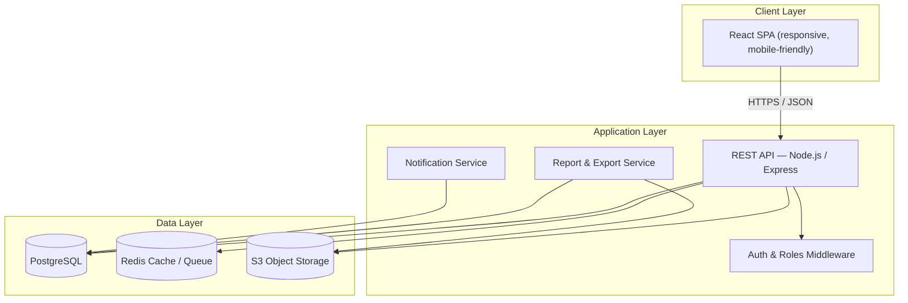
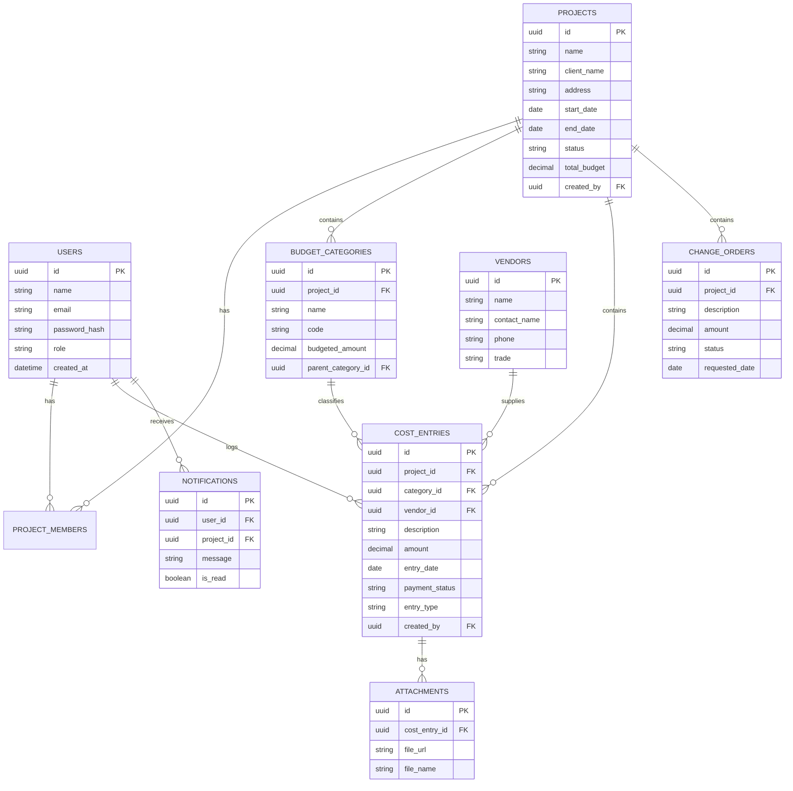

# Construction Cost Tracker — Web App Design Document

**Version 1.0** — Design Blueprint

## Table of Contents
1. Overview
2. Goals & Objectives
3. User Roles & Permissions
4. Core Features
5. Tech Stack
6. System Architecture
7. Database Schema
8. API Design
9. Key Screens & UX Flow
10. Cost Category Structure
11. Non-Functional Requirements
12. Development Roadmap
13. Future Enhancements
14. Appendix: Sample Budget Report

---

## 1. Overview

A **Construction Cost Tracker** is a web app that helps contractors, project managers, and small construction firms track project budgets against actual spending in real time. Users set a budget broken down by cost category (labor, materials, permits, etc.), then log expenses as they happen. The app surfaces budget-vs-actual variance, flags overruns early, and produces reports for clients, lenders, or internal review.

This document covers product scope, architecture, data model, and a phased build plan.

## 2. Goals & Objectives

- Give project managers one place to see **budget vs. actual** cost for every active project.
- Make logging an expense fast enough to do from a job site on a phone.
- Catch cost overruns **before** they become a problem (category-level alerts).
- Produce clean, exportable reports for clients, lenders, or accountants.
- Support multiple concurrent projects with role-based access for different team members.

## 3. User Roles & Permissions

| Role | Description | Permissions |
|---|---|---|
| **Admin / Owner** | Company owner or office admin | Full access: manage users, all projects, billing |
| **Project Manager** | Runs one or more projects | Create/edit projects, manage budgets, approve cost entries and change orders |
| **Site Supervisor / Foreman** | Field staff logging costs | Add cost entries and receipts on assigned projects only |
| **Accountant / Bookkeeper** | Handles finances | View all costs, export reports, mark payments as paid, no project editing |
| **Client / Viewer** *(optional)* | External stakeholder | Read-only view of budget summary for their project |

## 4. Core Features

### 4.1 MVP (Phase 1)
- Auth (signup/login, roles)
- Project CRUD (name, client, address, dates, total budget)
- Budget categories per project (custom or from a template)
- Cost entry logging (amount, category, vendor, date, description, receipt photo)
- Budget vs. actual dashboard per project (progress bars, totals, remaining budget)
- Basic vendor list

### 4.2 Phase 2
- Overrun alerts (email/in-app when a category passes a threshold, e.g. 90%)
- Change order tracking (approved scope/budget changes)
- Reports: cost-by-category chart, spend-over-time chart, PDF/Excel export
- Multi-project portfolio dashboard
- File attachments (receipts, invoices) stored per cost entry

### 4.3 Phase 3 / Future
- Payment / draw schedule tracking
- QuickBooks / Xero sync
- OCR receipt scanning → auto-fill cost entry
- Client-facing shared portal
- Native mobile app with offline entry queue
- AI-assisted cost forecasting based on historical projects

## 5. Tech Stack

Recommended stack — swap freely based on your team's existing skills:

| Layer | Recommendation | Notes |
|---|---|---|
| Frontend | React + TypeScript, Tailwind CSS | Fast to build, huge ecosystem |
| Charts | Recharts or Chart.js | Budget vs actual visualizations |
| Backend | Node.js + Express (or NestJS) | Alternative: Python + FastAPI |
| Database | PostgreSQL | Strong relational integrity for financial data |
| Auth | JWT + bcrypt, or Auth0/Clerk | Roles/permissions enforced server-side |
| File storage | AWS S3 / Cloudflare R2 | Receipts, invoices |
| Caching / queue | Redis | Dashboard aggregates, background jobs (PDF export, email) |
| Hosting | Docker → Render / AWS / Fly.io | Vercel for frontend if split-deployed |
| Monitoring | Sentry + uptime checks | Catch errors early |

## 6. System Architecture

## 7. Database Schema

## 8. API Design

Base path: `/api/v1`

| Resource | Method & Path | Description |
|---|---|---|
| Auth | `POST /auth/register` | Create account |
| | `POST /auth/login` | Get JWT |
| | `GET /auth/me` | Current user |
| Projects | `GET /projects` | List projects for current user |
| | `POST /projects` | Create project |
| | `GET /projects/:id` | Project details |
| | `PUT /projects/:id` | Update project |
| | `GET /projects/:id/summary` | Budget vs actual totals |
| Categories | `GET /projects/:id/categories` | List budget categories |
| | `POST /projects/:id/categories` | Add category |
| | `PUT /categories/:id` | Edit category / budgeted amount |
| Cost Entries | `GET /projects/:id/costs` | List cost entries (filterable) |
| | `POST /projects/:id/costs` | Log a new cost |
| | `PUT /costs/:id` | Edit a cost entry |
| | `DELETE /costs/:id` | Remove a cost entry |
| | `POST /costs/:id/attachments` | Upload receipt/invoice |
| Vendors | `GET /vendors` / `POST /vendors` | List / create vendors |
| Change Orders | `GET /projects/:id/change-orders` | List change orders |
| | `POST /projects/:id/change-orders` | Submit change order |
| | `PUT /change-orders/:id` | Approve/reject |
| Reports | `GET /projects/:id/reports/export?format=pdf\|xlsx` | Download report |

## 9. Key Screens & UX Flow

| Screen | Purpose | Key Elements |
|---|---|---|
| **Login / Signup** | Auth entry point | Email/password, "forgot password" |
| **Portfolio Dashboard** | Overview of all projects | Cards per project: % budget used, status badge, quick alerts |
| **Project Overview** | Single project home | Budget vs spent progress bar, category breakdown chart, recent cost entries |
| **Cost Entries** | Log & review expenses | Filterable table, "+ Add Cost" button opens quick-entry form |
| **Add/Edit Cost Modal** | Fast expense entry | Category dropdown, vendor autocomplete, amount, date, receipt photo upload |
| **Categories / Budget Setup** | Define budget structure | Editable table of categories with budgeted amounts; template picker for new projects |
| **Reports** | Analysis & export | Pie chart (spend by category), line chart (cumulative spend vs. time), export buttons |
| **Vendors** | Manage subcontractors/suppliers | Searchable list, contact info, trade/category tag |
| **Settings** | Team & account management | Invite users, assign roles, notification preferences, currency & locale |

Suggested primary flow for a field user: **Login → select project → "+ Add Cost" → snap receipt photo → done** — this should take under 30 seconds.

## 10. Cost Category Structure

A sensible default template to seed new projects with (fully customizable per project):

1. Site Prep & Permits
2. Foundation & Concrete
3. Framing & Structural
4. Roofing
5. Exterior (Siding, Windows, Doors)
6. Plumbing
7. Electrical
8. HVAC
9. Insulation & Drywall
10. Interior Finishes (Flooring, Paint, Trim)
11. Cabinetry & Countertops
12. Landscaping
13. Labor (General)
14. Equipment Rental
15. Contingency / Overhead

## 11. Non-Functional Requirements

- **Security:** bcrypt-hashed passwords, JWT with short expiry + refresh tokens, role-based access control enforced server-side (never trust the client), HTTPS everywhere, signed URLs for file uploads/downloads.
- **Performance:** paginate cost-entry lists, precompute/cache dashboard aggregates (Redis), lazy-load charts.
- **Scalability:** stateless API instances behind a load balancer so you can scale horizontally as project/user count grows.
- **Reliability:** automated daily DB backups, error tracking (Sentry), health-check endpoint for uptime monitoring.
- **Usability:** mobile-first for the cost-entry flow specifically (field use), desktop-first for reports/dashboards.
- **Auditability:** log who created/edited/deleted every cost entry and change order, with timestamps — important for disputes and audits.

## 12. Development Roadmap

| Phase | Est. Duration | Deliverables |
|---|---|---|
| **1 — MVP** | 3–4 weeks | Auth, project CRUD, categories, cost entry logging, basic budget-vs-actual dashboard |
| **2 — Reporting & Alerts** | 2–3 weeks | Vendor management, receipt attachments, overrun alerts, charts, PDF/Excel export |
| **3 — Team & Workflow** | 2–3 weeks | Multi-user roles, change orders, notifications, audit log |
| **4 — Polish & Scale** | Ongoing | Mobile responsiveness/PWA, performance tuning, integrations |

## 13. Future Enhancements

- Native mobile app with offline queue for job sites with poor signal
- OCR on uploaded receipts to auto-fill amount/vendor/date
- QuickBooks / Xero sync
- Client-facing read-only portal
- Predictive cost forecasting from historical project data

## 14. Appendix: Sample Budget Report

*Currency is configurable per project in Settings — figures below are illustrative.*

| Category | Budgeted | Actual | Variance | % Used |
|---|---|---|---|---|
| Foundation & Concrete | 50,000 | 52,300 | −2,300 | 104.6% |
| Framing | 80,000 | 76,500 | +3,500 | 95.6% |
| Electrical | 35,000 | 30,000 | +5,000 | 85.7% |
| Plumbing | 28,000 | 29,100 | −1,100 | 103.9% |
| **Total** | **193,000** | **187,900** | **+5,100** | **97.4%** |

This is the kind of summary the Project Overview dashboard and PDF export should produce for any project, at any point in the build.

---

*This doc is a blueprint, not code. Happy to help scaffold the actual project — DB migrations, API routes, or the React dashboard — whenever you're ready to start building.*
